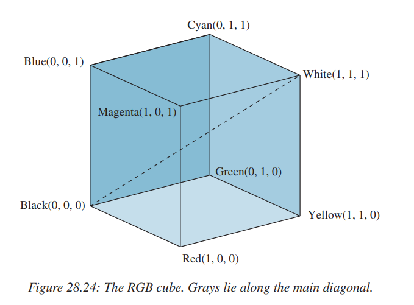

## Filters, contrast

1. Explain the difference between a low-pass filter and a high-pass filter. Provide examples of when each might be used.

   - `The Spatial Model 2.2.3`
   - `The Frequency Model 2.2.4`
   - `Filtering and Frequencies 2.4.3`
   - In the context of image processing and the Fourier Transform, frequency refers to the rate at which pixel intensity values change in an image. It describes how quickly the image data varies in space.
     - Understanding Frequency
       - `Low Frequency:` Regions of the image where the intensity values change slowly are considered to have low frequencies. These areas typically correspond to smooth, gradual variations in the image, such as large, uniform regions or gentle gradients.
       - `High Frequency:` Regions of the image where the intensity values change rapidly are considered to have high frequencies. These areas typically correspond to edges, fine details, and textures within the image.
     - https://www.quora.com/What-is-the-meaning-of-Fourier-transform-of-an-image-Why-is-it-important-in-image-processing
   - Let L be a filter and f a signal.
     - We say that L is a `highpass` filter if the action of L removes or attenuates the low frequencies in the signal, leaving the high frequencies mostly unchanged.
       - `Use Case:` Used for edge detection and image sharpening. For example, highlighting the edges and fine details in an image.
     - We say it is a `lowpass` or smoothing filter in the opposite situation, when high frequencies are removed.
       - `Use Case:` Used in image smoothing to remove noise. For example, blurring an image to reduce detail and noise.
     - A bandstop filter is one that selectively eliminates the frequencies in a certain band of the spectrum, while allowing to pass frequencies above and below this band. Finally, a bandpass filter eliminates frequencies outside a given band.

2. Describe the Gaussian filter. How is it implemented, and what effect does it have on an image?

In one dimension the kernel $G_{\sigma}(x)$ of the continuous-domain gaussian filter is given by the gaussian function
$$G_{\sigma}(x) = \frac{1}{\sigma \sqrt{2\pi}} e^{-x^2/(2\sigma^2)}$$
where $\sigma$ is a constant, called the variance of the function. In two dimensions the kernel is defined by
$$G_{\sigma}(x, y) = \frac{1}{2\sigma^2 \pi} e^{-(x^2 + y^2)/(2\sigma^2)}.$$

`Implementacion`: Para valores grandes de $n$ se puede aproximar el filtro gaussiano con las mascaras compuestas por los coeficientes binomiales (cg-class-7.pdf p. 12, Libro p.185
).

`Effect`: The Gaussian filter smooths the image, reducing noise and detail. It effectively averages the pixel values in the neighborhood defined by the Gaussian kernel, where the weights decrease with distance from the center

3. Define the concept of a convolution kernel. How is it used in image processing to apply filters? Illustrate with an example kernel and explain its effect on an image. - Libro p. 166 - `Definition:` A convolution kernel (or filter) is a small matrix used to apply effects such as blurring, sharpening, and edge detection to an image through the convolution operation. - `Usage in Image Processing:` Convolution kernels are applied to images by sliding the kernel over the image, computing the sum of the product of the kernel coefficients and the corresponding image pixels, and assigning this sum to the central pixel of the kernel position. - `Example Kernel:` Outline Kernel - An outline kernel (also called an "edge" kernel) is used to highlight large differences in pixel values. A pixel next to neighbor pixels with close to the same intensity will appear black in the new image while one next to neighbor pixels that differ strongly will appear white. - `Effect:` The outline kernel enhances the edges in an image, making them more prominent and easier to detect. It highlights the areas of high contrast, such as the boundaries between objects or regions with significant intensity changes. - https://setosa.io/ev/image-kernels/
   $$
   \begin{bmatrix}
   -1 & -1 & -1 \\
   -1 & 8 & -1 \\
   -1 & -1 & -1
   \end{bmatrix}
   $$
4. What is, in the frequency domain, the convolution in the spatial domain?

   - P. 47: eq 2.12
   - P.210 Ctrl + F: "multiplication in"
   - En el dominio de la frecuencia, la convolución en el dominio espacial corresponde a la multiplicación de las transformadas de Fourier de las dos señales implicadas. Específicamente, para dos señales $f$ y $g$, la convolución $f * g$ en el dominio espacial se puede expresar como:
     $$F(f * g) = F(f) \cdot F(g)$$
     donde $F$ denota la transformada de Fourier. Esto significa que, en lugar de realizar la convolución directamente en el dominio espacial, podemos transformar las señales al dominio de la frecuencia, multiplicarlas punto a punto y luego realizar la transformada inversa para obtener el resultado en el dominio espacial.

5. What is an edge detection filter? Name and describe one common edge detection filter.
   - `Concept:` An edge detection filter highlights regions in an image where there is a significant change in intensity, which usually corresponds to object boundaries.
   - `Example:` The Sobel filter is a common edge detection filter.
   - `Sobel Filter:`
     - `Description:` The Sobel filter uses two 3x3 kernels to detect edges in both horizontal and vertical directions.
     - `Effect:` These kernels emphasize horizontal and vertical edges by calculating the gradient of the image intensity at each pixel. The combined gradient magnitude provides the overall edge strength​.

$$
\text{Horizontal Kernel:} \quad
\begin{bmatrix}
-1 & 0 & 1 \\
-2 & 0 & 2 \\
-1 & 0 & 1
\end{bmatrix}
\\ \\
\text{Vertical Kernel:} \quad
\begin{bmatrix}
-1 & -2 & -1 \\
0 & 0 & 0 \\
1 & 2 & 1
\end{bmatrix}
$$

6. Explain the process and purpose of histogram equalization. How does it improve the contrast of an image?

- `Process and Purpose:`
  - `Description:` Histogram equalization is a technique used to improve the contrast of an image by redistributing the intensity values so that they span the entire range of possible values.
  - `Effect:` This process enhances the visibility of details in the image by making the intensity distribution more uniform.
- `Steps:`
  1. `Compute the Histogram:` Calculate the histogram of the image's pixel intensities.
  2. `Compute the Cumulative Distribution Function (CDF):` Calculate the cumulative sum of the histogram values.
  3. `Normalize the CDF:` Scale the CDF to span the full intensity range (e.g., 0 to 255 for 8-bit images).
  4. `Map the Intensities:` Use the normalized CDF to map the original pixel values to their new equalized values.
- `Result:` The equalized image has enhanced contrast, making features more distinguishable
- Ctrl + F: "Histogram equalization": `median cut algorithm`
- https://docs.opencv.org/4.x/d4/d1b/tutorial_histogram_equalization.html
- https://github.com/torywalker/histogram-equalizer/blob/master/HistogramEqualization.ipynb
- https://medium.com/@kyawsawhtoon/a-tutorial-to-histogram-equalization-497600f270e2
- https://docs.opencv.org/4.x/d4/d1b/tutorial_histogram_equalization.html

## Color theory

1. What is an additive color model?
- El additive color model define que un color está formado por dos o más colores sumando sus distribuciones espectrales. 
- Es sabido que un prisma descompone la luz blanca en más colores. Por lo tanto, Isaac Newton usando dos prismas demostró usando el segundo prisma que si pasamos los espectros de color obtenidos por el primer prisma se obtiene de nuevo luz blanca. Demostrando que los colores están compuestos unos de otros y no creados por el prisma, pensado anteriormente.

2. Describe the RGB color model. How is it used to represent colors in computer graphics?

- Es un additive color model que representa los colores como una combinación de Red, Green y Blue(RGB) a diferentes intensidades cada uno. La intensidad de cada color está en el rango de 0 a 1. Utilizando combinaciones de estos colores a diferentes intensidades se puede representar una gran gama de colores.
- Puede ser representado como un cubo. La diagonal entre (0,0,0) y (1,1,1) es la escala de grises

    

- Cada color representado por computador se puede como un triplete de valores (r,g,b) donde cada uno de estos varía según su intensidad, es así como este modelo es utilizado por dispositivos electrónicos para representar colores. 

3. Describe the HSV color model. How does it differ from the RGB model? In which situations it might it be preferrable?

- Hue-Saturation-Value es un modelo de color cilíndrico que separa la información del color(hue-(tono/matiz), saturation(saturación)) del brillo. Es una representación más intuitiva a cómo el ojo humano percibe los colores.
    - `Hue:` Representa al pureza del color, en un rango de 0° a 360°. Red 0°, Green 120°, Blue 240°, y los colores intermedios están representados en esos rangos. 
    - `Saturation:` Representa el coloreo. Va e 0%(escala de grises) a 100%(color puro).
    - `Value:` Representa el brillo. Va desde 0%(negro) a 100%(máxima intensidad). 

4. Explain the concept of color spaces and why different color spaces are used in computer graphics. Provide examples of at least three different color spaces and their applications.

- Los *color spaces* son modelos matemático que definen un rango de colores. Proveen una forma estandarizada de capturar, almanacenar y representar los colores en una forma digital. Es necesario para representar y manipular de forma precisa los colores.
- Tres diferentes *color spaces* son: RGB, HSV y CMYK
    - **RGB**: Es ampliamente usado para representar colores en imágenes digitales y monitores. Es ideal para dispositivos radiantes ya que solo se debe representar los colores de forma aditiva.
    - **HSV**: Es más usado en procesamiento de imágenes para manipular color y detección de objetos basados en color o segmentación. 
    - **CYMK**: Este color space es crucial en la impresión debido a que es preciso al momento de imprimir un color. Asegura la consistencia en la impresión de un color

5. Given the RGB values (34, 139, 34), convert this color to its equivalent in the HSV color space. Show all steps of your conversion.

To convert the RGB color (34, 139, 34) to its equivalent in the HSV color space, we can follow these steps:

*Step 1: Normalize the RGB values to the range .*
R = 34 / 255 = 0.133
G = 139 / 255 = 0.545
B = 34 / 255 = 0.133

*Step 2: Determine the maximum (Max) and minimum (Min) values among the normalized RGB values.*
Max = max(0.133, 0.545, 0.133) = 0.545
Min = min(0.133, 0.545, 0.133) = 0.133

*Step 3: Calculate the Hue (H) value.*
If Max = Min, then H = 0 (undefined).
Otherwise, 
If Max = R, then H = 60 * ((G - B) / (Max - Min)) % 360.
If Max = G, then H = 60 * ((B - R) / (Max - Min)) + 120.
If Max = B, then H = 60 * ((R - G) / (Max - Min)) + 240.

In this case, Max = G, so:
H = 60 * ((B - R) / (Max - Min)) + 120
H = 60 * ((0.133 - 0.133) / (0.545 - 0.133)) + 120
H = 120 degrees

*Step 4: Calculate the Saturation (S) value.*
If Max = 0, then S = 0 (undefined).
Otherwise, S = (Max - Min) / Max.

S = (0.545 - 0.133) / 0.545
S = 0.756 or 75.6%

*Step 5: Calculate the Value (V) value.*
V = Max.

V = 0.545 or 54.5%

Therefore, the equivalent HSV color for the given RGB values (34, 139, 34) is:
- Hue (H): 120 degrees
- Saturation (S): 75.6%
- Value (V): 54.5%

## Computational Geometry

1. Define the convex hull of a set of points in the plane. Describe an algorithm to find the convex hull and explain its time complexity.
   - `convex hull`
     - The convex hull of a set of points in the plane is the smallest convex polygon that contains all the points.
   - `algorithm`
     - Be `n` the number of points in the plane
     - `Jarvis March`
       - `complexity`: O(nh), where `h` are the number of points of the convex hull
     - `Graham Scan`
       - `complexity`: O(nlogn), for sorting the points
2. Explain the concept of Delaunay triangulation. How is it related to the Voronoi diagram?
   - `Delaunay triangulation`
     - A Delaunay triangulation is a triangulation of a set of points such that no point is inside the circumcircle of any triangle in the triangulation.
   - `Voronoi diagram`
     - The Voronoi diagram is a partitioning of a plane into regions based on the distance to a specific set of points.
     - The Delaunay triangulation and the Voronoi diagram are duals of each other, meaning that each circumcenter of the circles in the Delaunay triangulation are a vertex in the Voronoi diagram.
   - https://scicomp.stackexchange.com/questions/32598/how-can-one-prove-the-duality-of-voronoi-and-delaunay
3. Describe the concept of a [sweep line algorithm](https://en.wikipedia.org/wiki/Sweep_line_algorithm). Provide an example of a problem where this technique is useful.
   - `sweep line`
     - The sweep line algorithm is a technique used to solve geometric problems by sweeping a line across the plane and processing the events that occur as the line moves.
     - [Line Sweep](https://leetcode.com/discuss/study-guide/2166045/line-sweep-algorithms) (or Sweep Line) is an algorithmic technique where we sweep an imaginary line (x or y axis) and solve various problem. There would be an event (entry or event) and based on that we update the information and then return result.
   - examples
     - `Bentley-Ottmann algorithm`: to count the number of intersections in a set of line segments.
     - `Fortune's algorithm`: to compute the Voronoi diagram of a set of points.
     - `Area of the union of rectangles`, `Maximum intervals overlap`, `Closest pair of points`:
       - https://www.topcoder.com/thrive/articles/Line%20Sweep%20Algorithms
       - https://www.hackerearth.com/practice/math/geometry/line-sweep-technique/tutorial/
       - https://medium.com/silvathiago/sweep-line-algorithm-8c878b006883
4. Describe the sweep line algorithm for deciding if there are intersections in a set of line segments. What is the time complexity of this algorithm?
   - `sweep line algorithm`
     - `Shamos & Hoey`: "nearest line above" and "nearest line below"
       - https://cs.stackexchange.com/questions/22443/shamos-hoey-line-segment-intersection-runtime
       - Cormen p. 1021
     - `Bentley-Ottmann algorithm`
       - `complexity`: O((n + k)logn), where `n` is the number of line segments and `k` is the number of intersections.
5. Prove that if we have 2 vectors $v_1 = (x_1, y_1)$ and $v_2 = (x_2, y_2)$, then
   $$
   \left| \det \begin{pmatrix}
   x_1 & y_1 \\
   x_2 & y_2
   \end{pmatrix} \right| = \left| x_1 y_2 - y_1 x_2 \right|
   $$
   is equal to area of the parallelogram with sides parallel to $v_1$ and $v_2$.

- https://cp-algorithms.com/geometry/basic-geometry.html

    

6. Prove that the area of a convex polygon of vertices $v_1 = (x_1, y_1)$, $v_2 = (x_2, y_2), . . . , v_n= (x_n, y_n)$ is equal to

$$
\frac{1}{2} \left| \begin{pmatrix}
x_1 & x_2 & x_3 & \cdots & x_n \\
y_1 & y_2 & y_3 & \cdots & y_n
\end{pmatrix} \right| = \left( x_1 y_2 + x_2 y_3 + \cdots + x_n y_1 \right) - \left( y_1 x_2 + y_2 x_3 + \cdots + y_n x_1 \right)
$$

**NOTICE THAT** this formula applies also to triangles. We can compute the area
of a triangle also in this way. The expression

$$
\frac{1}{2} \left| \det \begin{pmatrix}
x_2 - x_1 & y_2 - y_1 \\
x_3 - x_1 & y_3 - y_1
\end{pmatrix} \right|
$$

Is equivalent to:

$$
\frac{1}{2} \left| \begin{pmatrix}
x_1 & x_2 & x_3 \\
y_1 & y_2 & y_3
\end{pmatrix} \right| = \left( x_1 y_2 + x_2 y_3 + x_3 y_1 \right) - \left( y_1 x_2 + y_2 x_3 + y_3 x_1 \right)
$$

- https://erkaman.github.io/posts/area_convex_polygon.html

    

    

7. Given 3 points $a, b, p \in R^3$, propose a mathod to determine if the point $p$ is in the
   segment $\overline{ab}$. - `point in segment` - Calculate the component $z$ of the cross product between the vectors $\overrightarrow{ap}$ and $\overrightarrow{ab}$. - If the component $z$ is zero, the point $p$ is collinear with the segment $\overline{ab}$. - If point $p$ is collinear with the segment $\overline{ab}$, check if the coordinates of $p$ are between the coordinates of $a$ and $b$. - If true, then the point $p$ is in the segment $\overline{ab}$. - If false, then the point $p$ is not in the segment $\overline{ab}$.
8. Consider a parametrization of the sides of a convex quadrilateral ABCD as follows:

$$
\begin{align*}
A + t(B - A)\\
D + t(C - D)\\
A + s(D - A)\\
B + s(C - B)
\end{align*}
$$

with $P = (s, t)$ in $[0, 1] ×[0, 1]$.

Design a map function that maps an image whose shape is any quadrilateral into
other image whose shape is another quadrilateral, given the coordinates of both
quadrilaterals. Describe how would you use it in order to enable the following
transformations:

Para un punto P en el espacio de parámetros $[0,1]×[0,1]$, aplicamos interpolacion bilineal:
$$P(s, t)=(1 − s)(1 − t)A + s(1 − t)B + stC + (1 − s)tD$$
$$P'(s, t)=(1 − s)(1 − t)A' + s(1 − t)B' + stC' + (1 − s)tD'$$

Donde $A, B, C, D$ son los vértices del cuadrilátero original y $A', B', C', D'$ son los vértices del cuadrilátero destino.

**Interpretación**

- Cuando s = 0 y t = 0, P(s, t) será exactamente el punto A en el cuadrilátero de origen, y P'(s, t) será A' en el cuadrilátero de destino.
- Cuando s = 1 y t = 0, P(s, t) será el punto B en el origen y P'(s, t) será B' en el destino.
- Cuando s = 1 y t = 1, P(s, t) será el punto C en el origen y P'(s, t) será C' en el destino.
- Cuando s = 0 y t = 1, P(s, t) será el punto D en el origen y P'(s, t) será D' en el destino.

9. What is the point-in-polygon problem? Describe an algorithm to determine if a point lies inside a polygon and explain its complexity.
   - `point in polygon`
     - Given a list of vertices of a polygon in counterclockwise order
     - For each edge of the polygon, check if the point is to the left of the edge with cross product.
     - If the point is to the left of all edges, then the point is inside the polygon.
     - If the point is to the right of any edge, then the point is outside the polygon.
     - `complexity`: O(n)
10. Describe one algorithm for computing the intersection of two convex polygons. Analyze the complexity of the proposed approach.
    - `intersection of convex polygons`
      - Be n, m the number of vertices of the two polygons and the list of vertices of the two polygons be sorted in counterclockwise order.
      - In O(nm + mn) time compute if any point of one polygon is inside the other and save the points that are inside in two different "inside lists".
      - Then, for each pair of consecutive points representing an edge of one of the "inside list", find the intersection point with some of the edges from the other "inside list", then save this intersection points.
      - With the 2 "inside list" and the intersection points, we can obtain the polygon formed by the intersection of the two polygons.
      - Finally, we can sort the vertices of the intersection polygon in counterclockwise order in O(n + m) time to calculate the final area.
      - `complexity`: O(nm + mn + (n + m)log(n + m))
11. Discuss the importance of computational geometry in the field of computer graphics. Provide at least three specific examples where computational geometry is applied.
    - `importance`
      - Computational geometry plays a critical role in the field of computer graphics, as it provides the fundamental algorithms and data structures necessary to handle geometric objects efficiently.
        - Object representation and manipulation: mesh generation, shape analysis
        - Modeling and simulation: CAD/CAM
        - Spatial data structures: GIS
        - Interactive graphics: collision detection
    - `specific examples`:
      - `Ctrl + F: applications` | capitulo 1.3 "Computational Geometry algorithm and applications"
      - robotics
      - GIS
      - CAD/CAM
12. Define the term _polygon triangulation_. Describe an algorithm for triangulating a simple polygon and explain its time complexity.
    - `polygon triangulation`:
      - A polygon triangulation is a set of diagonals that divides the polygon into triangles.
      - Partition of a polygonal area into triangles.
    - `# polygon triangulations (Catalan Numbers)`
      - Gabriel Lame 1838
      - Split a polygon into two smaller sub-polygons by a triangle with fixed base.
        - Choose a base edge $\overline{P_iP_{i+1}}$.
        - Consider all triangles, which can be drawn using this edge and some vertex ("moving vertex") of the polygon
        - For each such triangle we consider triangulations of sub-polygons to the left and to the right of this triangle.
      - Resulting recursive expression:
        - $T(n) = \sum_{i=1}^{n-2} T(i) * T(n-i-1)$, assuming that $T(2) = 1$ and $i \in [2, n-1]$.
      - Time complexity: `O(n)` with dynamic programming.

## Other possible questions:
- Explain Fortune's algorithm
- Explain how to convert from RGB to CMYK